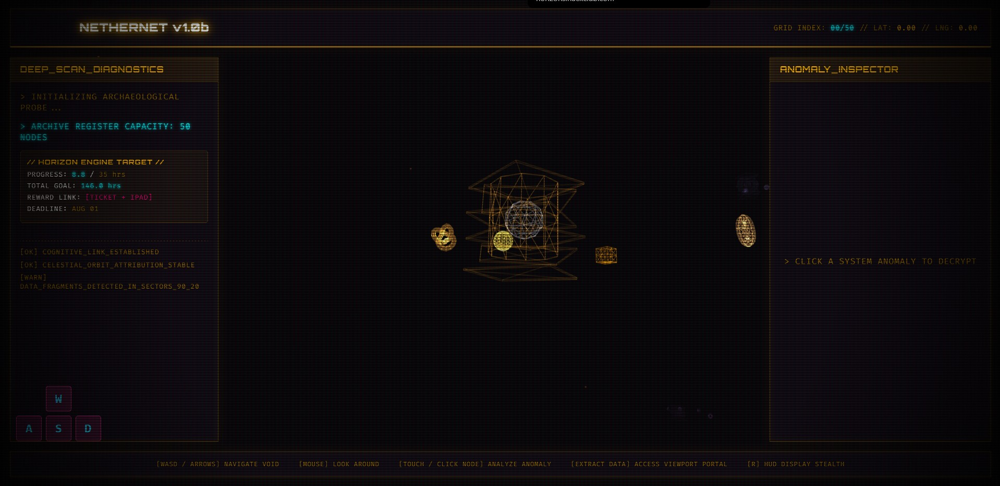

# Nethernet

Nethernet is a high-performance 3D visualization engine that maps the history of the "dead internet", including the forums, MMOs, personal homepages, and hosting platforms that defined the early web but have since faded into the void.

**Live Link:** [Vercel](https://nethernet.vercel.app/)

---

## Simulation Overview

<div align="center">

<!-- The Screenshot -->


<br>

<br>

<!-- Direct Link to the Video File -->
**[▶ Watch Full-Resolution Simulation Demo](assets/Nethernet.mp4)**  
*Opens in a new tab.*

<p><em>A brief look at the agent-based dynamics in action.</em></p>

</div>

---

## Impermanence

The internet is often viewed as permanent, but vast swathes of human culture have been lost to link rot, server shutdowns, and corporate consolidation.

Entire communities, such as GeoCities neighbourhoods, Flash cathedrals and MySpace profiles, vanished with just a 404.

Nethernet is a spatial time machine. It transforms archival data from the Internet Archive's Wayback Machine into an explorable, atmospheric 3D environment. Fly through the wreckage. Click on ghosts. Watch the architecture of the early web pulse and shift around you.

It also serves as a reminder that digital memory is fragile. We may be the first generation to face the genuine possibility that our cultural artifacts will not survive us.

---

## The Experience

- **Spatial Navigation**: Glide through a dark, high-fidelity void where data clusters represent distinct digital eras.
- **Ghost Links**: Interact with procedurally generated nodes that link directly to archived snapshots of abandoned websites.
- **Kinetic Data**: Watch the architecture of the internet shift and pulse based on temporal data and user interaction.
- **Terminal Aesthetic:** A custom HUD with CRT scanlines, real-time coordinate tracking, diagnostic logs, and a full inspector panel for every discovered site.

---

## About the Archive

From the primordial soup of the World Wide Web (CERN, 1991) to the corporate ghost towns of the 2020s (Quibi, Stadia), the database maps a lost continent. Each entry includes a title, year, description, and direct Wayback Machine link.

---

## Technical Architecture

Nethernet is built for performance and portability, leaning on modern web standards to provide a rich 3D visual experience without heavy external dependencies.

- **Rendering Engine:** Three.js / WebGL for high-performance 3D spatial environments. Six custom geometry profiles (box, sphere, torus, knot, cone, cylinder) with wireframe materials, additive blending, and dynamic opacity.
- **Data Integration:** Fetches live archival snapshots via the Internet Archive Wayback Machine Availability API. If no closest snapshot is found, gracefully falls back to a direct timestamped URL.
- **UI/UX:** Fully custom terminal-style HUD built with raw CSS and optimized browser APIs. Includes CRT scanlines, real-time coordinate tracking, diagnostic logging, an inspector panel, and a dedicated archive viewport with sandboxed iframe.
- **Mobile Support:** On-screen directional keypad for touch devices, with responsive layout and adaptive pointer events.
- **Audio & Effects:** Procedural Web Audio API sound effects (hover, click), screen shake, and a glitch overlay for immersive feedback.
- **Performance:** Dependency-minimal. No frameworks beyond Three.js. Sub-second load times, efficient raycasting, and particle system with velocity-based drift.

```text
nethernet/
├── index.html      # Semantic DOM, HUD layout, archive viewport
├── style.css       # CRT aesthetics, panel design, animations
├── main.js         # Three.js engine, physics, API integration, audio
└── README.md
```

## Why Does This Matter?

The early internet was a wildly creative, deeply human space. It was built by amateurs, maintained by enthusiasts, and largely forgotten by the corporations that now dominate the web.

When a server goes offline, an entire world disappears. This project aims to make those worlds visible again... if only for a moment.